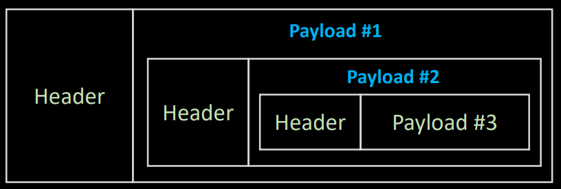

# study-tcp-ip-network-essentials-for-beginners
인프런 외워서 끝내는 네트워크 핵심이론 - 기초 강의 정리

# 들어가기에 앞서...
## 수강 전에 알고 있다고 가정하는 것들
### 수강에 앞서
1. bit, byte 등 정보 표현 단위를 알고 있다.
2. 1 byte는 8bit임을 알고 있다.
3. bit 단위 논리연산 (AND, OR, XOR 등)을 할 수 있다.
4. 2진수를 16진수로 변관할 수 있다.
5. 1024MB가 1GB임을 알고 있다.
6. Process와 Program의 차이를 알고 있다.
7. OSI 7 layer라는 말을 알고 있다.
8. 범용 운영체제는 User mode와 Kernel mode가 존재한다는 것을 알고 있다.
9. Buffer의 의미를 알고 있다.
10. 개념(Abstraction)과 구현(Implementation)의 차이를 안다.

## Layer와 Layered 구조
위의 layer는 아래 layer에 의존적이다.

## 네트워크와 네트워킹 그리고 개념
Network = 상호작용  
의존적 관계가 성립되는 계층구조 

### 개념과 구현(혹은 실체)
연예인 (추상적 - 개념(요소)) - 박은빈 (구체적 - 구현)

## User mode와 Kernel mode
- Application : L7
- Presentation : L6
- Session : L5
- Transport : L4
- Network : L3
- Data Link : L2
- Physical : L1 (NIC)

# Internet 기반 네트워크 입문

## OSI 7 layer와 식별자
- Application : L7 - HTTP  
- Presentation : L6 - X 
- Session : L5 - SSL (TLS)
- Transport : L4 - TCP, UDP / 식별자 : Port 번호 (Process(L7) / Interface(L1) / Service(L4))
- Network : L3 - Internet / 식별자 : IP 주소 (host에 대한 식별자) 
- Data Link : L2 - Ethernet / 식별자 : MAC주소 (물리적 주소)
- Physical : L1 - X 

식별자를 잘 알아두기!!

## Host는 이렇게 외우자
Computer가 Network에 연결이 되어있으면 Host가 된다. (Host == Network에 연결된 Computer)
- **Switch** : Network 그 자체를 이루는 host (Network의 기능, Infrastructure) - ex) Router(L3 switch의 일종), IPS(보안 switch), Tab, Aggregation
- **End-point** : Network 인프라를 이용하는 이용주체 (단말기) - 대표적인 것 : Client, Server (단말기의 역할에 따라 구분), Peer(Client와 Server를 동시에)

## 스위치가 하는 일과 비용
### Switch가 하는 일
출발지 ~ 목적지 까지 가는 길에 경로 선택    
교차로가 Switch, 경로가 Interface, 경로선택은 Switching     
IP주소를 근거로 Switching 하면 L3 Switching (Router), 이정표는 Routing Table

만약에 MAC주소를 가지고 Switching 하면 L2 Switching,   
Port 번호로 Switching -> L4 Switch,    
HTTP 프로토콜로 Switching -> L7 Switch이다.

### 항상 고민해야 할 주제는 '비용'
Matric : 이동하는 데 드는 비용

# L2 수준에서 외울 것들

## NIC, L2 Frame, LAN카드 그리고 MAC 주소
### NIC + L2 Frame + LAN card + MAC
- NIC(Network Interface Card)는 흔히 LAN(Local Area Network) 카드이다.
- 유/무선 NIC이 있지만 굳이 구별하지 않고 NIC이라고 할 때가 많다.
- NIC은 H/W이며 MAC 주소를 갖는다.

Network의 규모 : WAN > MAN > LAN

Packet : L2에서 언급하는 인터넷에서의 단위
L2 수준에서의 단위 : Frame (데이터 유통단위)

## L2 스위치에 대해서
### L2 Access switch
- End-point와 직접 연결되는 스위치
- MAC주소를 근거로 스위칭
- Link up : L2 Access에 연결이 잘 되었다.
- Link down : L2 Access에 연결이 해제되었다. (케이블에 문제가 생겼거나 연결이 해제됨)

### L2 Distribution switch
- 쉽게 생각하면 L2 Access 스위치를 위한 스위치
- VLAN(Virtual LAN) 기능을 제공하는 것이 일반적

## LAN과 WAN의 경계 그리고 Broadcast
- Broadcast 범위를 생각해보자.
- Broadcast 주소라는 매우 특별한 주소가 존재한다. (MAC, IP 모두 존재)
- 논리적인 것인지 아니면 물리적인 것인지로 구분하는 것도 방법이다.
- 일단 MAN(Metropolitan Area Network)은 제외하자.

MAC - 48bit / FF == 11111111, (FF-FF-FF-FF-FF-FF) => 이 경우가 Broadcast
Broadcast는 최소화시키는 것이 효율적이다. (Broadcast 중에는 다른 통신을 할 수 없기 때문)
Physical(물리적, H/W)로 설명되는 부분이 LAN이라고 생각하면 된다.

# L3 수준에서 외울 것들

## IPv4 주소의 기본 구조
### IPv4 주소의 구조
- MAC주소는 L2계층에서 가장 중요한 식별자, 48bit 주소체계를 가진다.
- IP는 32bit 주소체계를 가진다. = 8bit * 4
- 2의 8승 == 256, 0000 0000 ~ 1111 1111(2) 까지 0~255
- IP주소는 Network ID와 Host ID로 구성된다.
- Network ID는 8bit씩 끊어서 세부분으로 나뉜다. 

## L3 IP Packet으로 외워라
### L3 Packet (단위 데이터)
- Packet이라는 말은 L3 IP Packet으로 외워라
- Header와 Payload로 나뉘며 이는 상대적인 분류이다.
- **최대 크기는 MTU** (중요!!) 보통 MTU는 1500byte정도임.

- Header가 실어나르는 대상이 Payload
- Header 정보에서 가장 중요한 정보 (Src(출발지) -> Dst(도착지))
- Network를 감청하는 프로그램 : Wireshark (Analyzer, Sniffer)

## Encapsulation과 Decapsulation
### Encapsulation
- 별것 아니다. 러시아 전통 목각인형인 마트료시카 인형을 떠올려라.
- 단위화하고 포장을 하는 것.

### En/Decapsulation

- 이 전체는 Frame (L2)
- 그 안은 IP Packet (L3), L2 Frame의 Payload
- 그 안은 TCP Segment (L4), L3 Packet의 Payload
- Encapsulation은 합치는 것
- Decapsulation은 분해하는 것

## 패킷의 생성, 전달
### 패킷의 생성, 전달, 소멸
Process가 어떤 데이터를 다른 Process에게 전달해야할 때
전달할 데이터를 Packet으로 만든다.
우리집(Host) 현관(Interface)에서 택배기사님(Gateway)에게 전달
처리 후 받을 Process의 Host에게 전달

### Process가 어떤 데이터를 인터넷을 통해 다른 Process에게 전달하는 과정
1. Data가 있다고 가정, Process와 Kernel을 이어주는 Tcp Socket(File의 일종, Kernel mode 프로토콜을 User mode Application Process가 접근할 수 있도록 추상화 시켜준 Interface)에 write(send)
2. Tcp 소켓에서 Data에 Tcp Header를 붙여서 Segment화 한다.
3. 한 층 더 내려가 IP Header가 또 붙는다.
4. 한 층 더 내려가면 Ethernet Frame Header가 붙는다.
5. Driver를 통해 L2 Access를 통해서 나가고 Router를 지나 인터넷으로 나간다.

## 계층별 데이터 단위
- Socket(L5 ~ L7) 수준 : Stream
- L4 : Segment [MSS (Maximun Segment Size)] - 최대 1460 byte
- L3 : Packet [MTU (Maximun Transmission Unit)] - 최대 1500 byte
- L1 ~ L2 : Frame

Stream의 특징 : 시작은 있으나 끝을 정의할 수 없다. Application 수준에서 끝을 정한다.
Stream이 Packet이나 Segment의 최대 크기보다 클 때 분할한다.

## 이해하면 인생이 바뀌는 TCP/IP 송수신 구조
### 파리에서 에펠탑을 택배로 보내려면 어떻게 해야할까?
1. 에펠탑을 분해 -> 크기 줄이기 - Packet (MTU 이하로) : 송신측
2. 운송
3. 조립 : 수신측

### TCP 연결이 되었다는 가정 하에 데이터를 송수신한다.
#### 송신하는 과정 (Encapsulation)
1. Process에서의 파일을 보낼 때 파일을 copy해서 Buffer에 올린다.
2. Socket에 I/O할 때 Buffer(메모리공간)가 존재, Socket의 Buffer에도 또 copy해서 올린다. (Process에서 Socket에 파일을 Send한다.)
3. User mode에서 Kernel로 넘어갈때 TCP로 갈 때 분해(Segmentation)가 일어난다. -> 이 때의 데이터 단위를 Stream이라고 한다.
4. TCP에서 분해된 개념이 Segment가 된다.
5. Segment화 된 데이터가 한 층을 더 내려간다(IP 층)
6. Segment를 박스(Packet) 속에 넣는다.
7. L2로 내려간다. 트럭(Frame)에 실려 전송된다.

#### 수신하는 과정 (Decapsulation)
1. L2수준에서 트럭(Frame)에 담긴 택배(Packet)가 올라간다.
2. L3에서 택배(Packet) 안에서 담긴 Segment를 꺼낸다.
3. L4수준에서 TCP에서 Socket의 I/O Buffer에 쌓는다.
4. Process의 Buffer에 Socket의 Buffer에 담겨있던 데이터를 담는다.
5. TCP의 Buffer에 저장될 때 송신하는 Process 쪽에 ACK를 보낸다. (1,2를 보냈을 때 ACK 3 + 여유공간의 크기를 보낸다.)  
Socket I/O Buffer의 여유공간 : Window Size라고 한다.

-> TCP 통신은 순서가 중요한 개념!! 

### Network 장애
1. Loss (Lost Segment) - Segment를 유실 : 100% Network 문제
2. Re-transmission (송신 측에서 데이터를 보낸 후 ACK를 기다리는데, 일정 시간 후 ACK가 오지 않으면 다시 데이터를 보낸다.) + ACK-Duplicate (ACK를 중복) : Network 일 수도 있고 End-point 간의 문제일 수 있다.
3. Out of order (순서대로 와야하는데 1,2가 온 후 3이 오지 않고 4가 오는 경우) : 거의 Network 문제
4. Zero window : End-point 단계에서 Application이 데이터를 빨리 안끌어간 것. (문제가 프로그램에 있음)